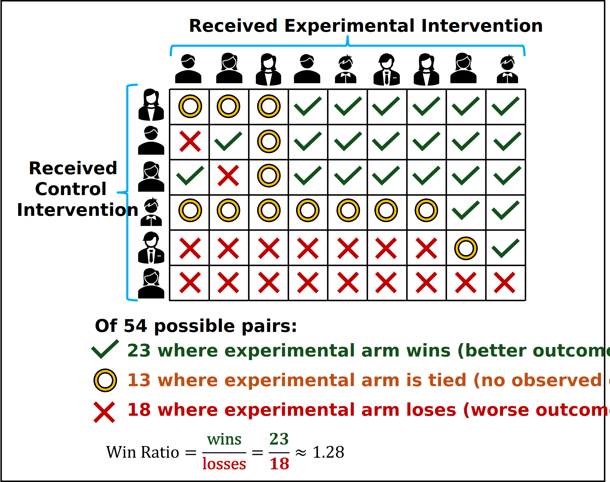

# COMPARE WINS 

**C**omparison **O**f **M**ultifaceted **P**references **A**s **R**esearch **E**ndpoints **U**sing **WIN** **S**tatistics

## Overview

A clinician-friendly point-and-click interface for analysing medical research data using the Generalised Pairwise Comparisons approach

<!-- BEGIN LATEST DOWNLOAD BUTTON -->

<!-- END LATEST DOWNLOAD BUTTON -->

## What are Generalised Pairwise Comparisons?

Generalised Pairwise Comparisons estimate the chance that a randomly selected participant from the treatment group will have a better outcome than a randomly selected participant from the control group. Other names for the approach include the Win Ratio and Desirability Of Outcome Ranking (DOOR)

Because the idea of 'better outcome' is extremely general, Generalised Pairwise Comparisons can consider trade-offs between multiple clinical outcomes. This allows the approach to better reflect the multifaceted nature of health outcomes.

## Features

COMPARE WINS provides a comprehensive analysis suite for using Generalised Pairwise Comparisons. It includes:

* Sample Size Estimation
* A Data Analysis Suite, including:
  * Several methods for defining 'better outcome' that have been described in medical literature
  * Several analysis methods for analyzing differences in outcome based on this definition
  * Templated methods and results for reporting
  * Automated visualisation of results
* Documentation describing various methods that come under the GPC umbrella

